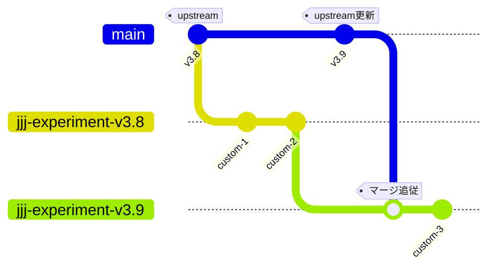
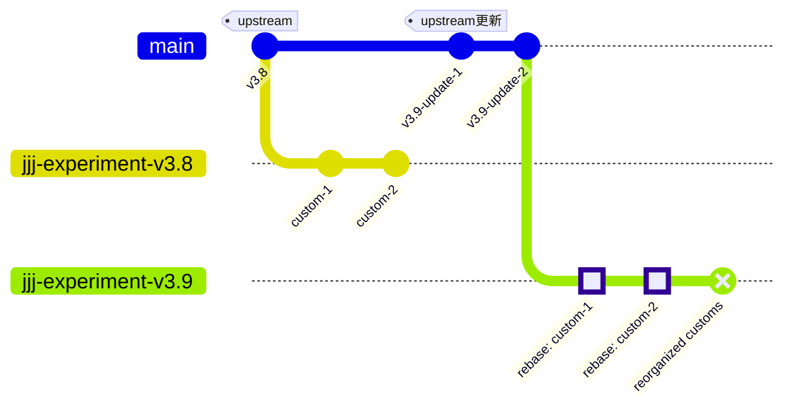

# バージョンアップにおける Git ブランチ戦略

## 概要

本リポジトリは `BRI-EES-House/pyhees` からフォークしており、upstream のバージョンアップに追従する必要があります。
更新追従方法は、下記の2種類のブランチ戦略からバージョンアップの内容に応じて使い分けます。

## 追従方法

### 1. マージアップデート追従

**適用場面**: upstream の更新内容が軽微で統合が容易なとき

**特徴**:
- ✅ 手順がシンプルかつ一般的な更新方法
- ⚠️ 大規模な更新時はコンフリクト解消が難しい可能性がある

### 2. リベースアップデート追従

**適用場面**: upstream の更新内容が複雑でコンフリクト処理を分割したいとき

**特徴**:
- ✅ 大規模な更新でもコンフリクトを小分けにして処理
- ✅ `reset --mixed` で upstream に対するクリーンな履歴をつくれる
- ⚠️ バージョンアップのための手数が多い

## ブランチ命名規則

### 命名規則

`jjj-experiment-v3.x`

- `3.x` は追従済みの upstream バージョン（例: `jjj-experiment-v3.8`, `jjj-experiment-v3.9`）
- 古いバージョンのブランチは定期的に削除

### なぜブランチ名を変える必要があるのか

通常、多くのプロジェクトでは `main` や `develop` といったブランチを継続して使い続けます。
しかし、本リポジトリでは**リベースアップデート追従**を採用するケースで新規ブランチが必要になります。

**副次メリット**: ブランチ名から追従済みのベースバージョンが一目でわかる
