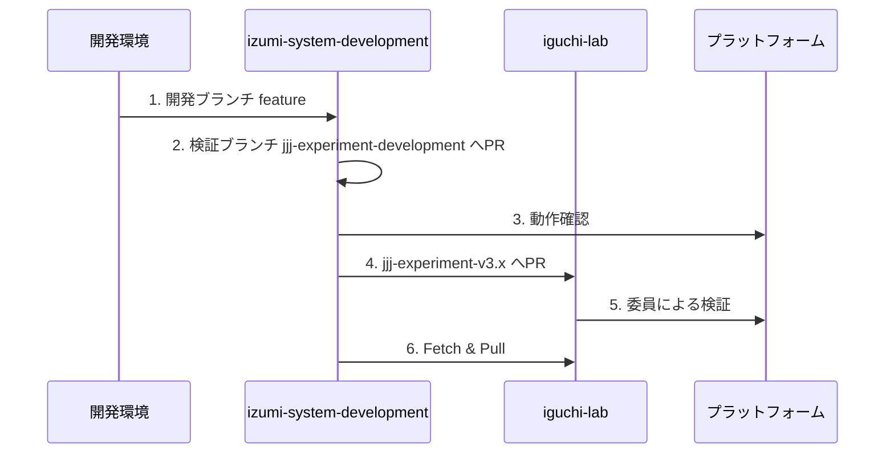
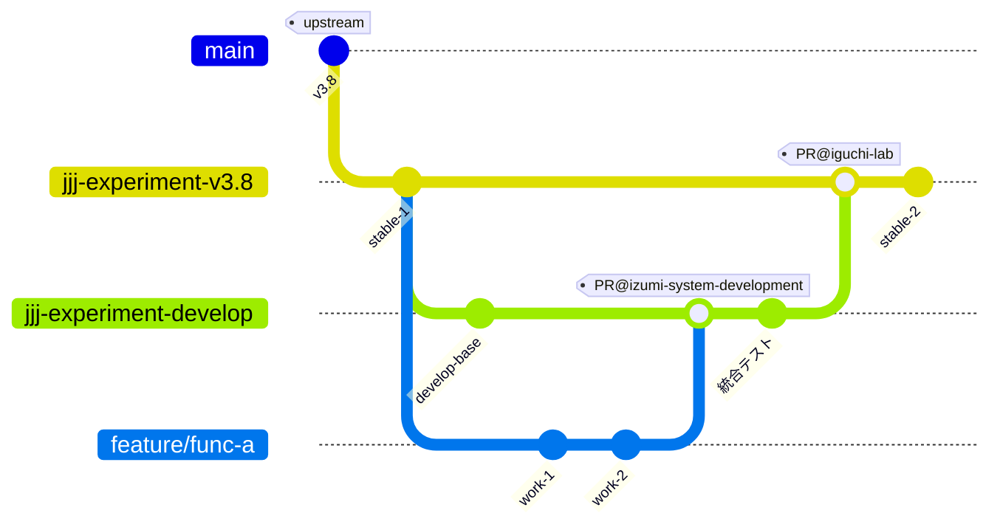
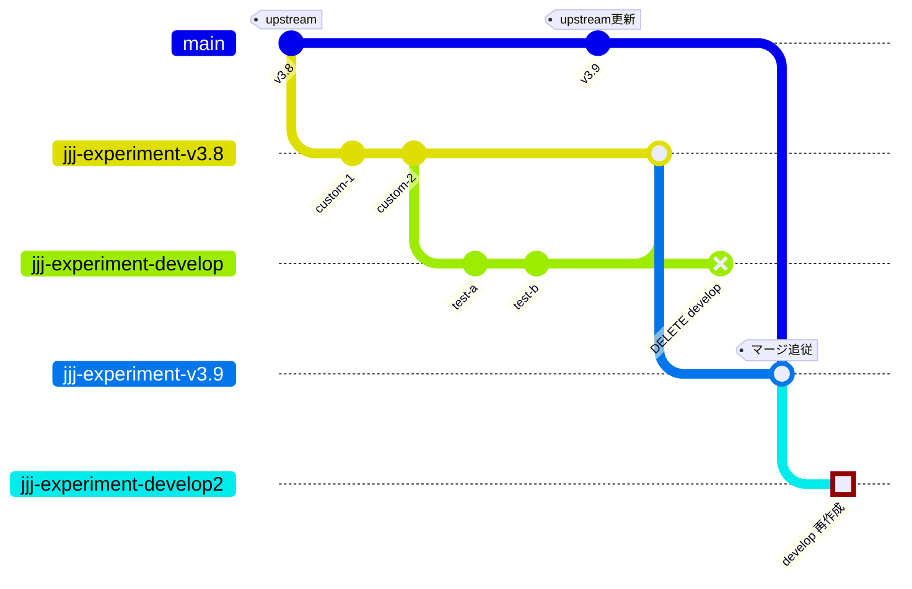
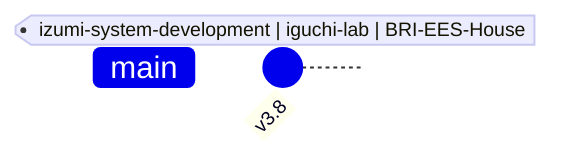

# 開発時における Git ブランチ戦略

## 概要

本リポジトリは `BRI-EES-House/pyhees` からフォークしており、独自機能を追加しながら開発を進めています。開発した独自機能はプラットフォームにて公開され、委員による検証を進めています。

## リポジトリの種類

本プロジェクトは 3 つのリポジトリで構成されています。

BRI-EES-House/pyhees: 建築研究所
┣ iguchi-lab/pyhees: 井口研究室
┗ izumi-system-development/pyhees: イズミコンサルティング

## 開発からリリースの流れ

開発した機能は以下の流れでユーザーに公開されます：

## ブランチの種類と役割

### 1. リリースブランチ jjj-experiment-v3.x

**役割**: 特定バージョンの upstream に対する安定版カスタム機能を提供

**特徴**:
- ✅ プラットフォームで委員へ公開され検証される
- ✅ upstream の対応バージョンが明確（例: `jjj-experiment-v3.8`）
- ✅ 検証ブランチからマージされた機能を統合
- ⚠️ 直接このブランチでの開発は避け PR によって更新する

**リリースまでの開発フロー**:

### 2. 検証ブランチ jjj-experiment-develop

**役割**: 実験的な機能や複数機能の統合テストを行う開発用ブランチ

**特徴**:
- ✅ 新機能の統合テスト環境
- ✅ 複数の feature を統合して動作確認
- ⚠️ **不安定な状態になる可能性がある**
- ⚠️ **リリースブランチの新バージョンが作られる度に作り直す必要がある**

**用途**:
- 複数機能の組み合わせ動作確認
- 統合テスト環境
- デモ環境

**ライフサイクル（バージョンアップ時の作り直し）**:

リリースブランチのバージョンアップがされる度に作り直す。
その際、ローカルだけでなくリモートからもブランチを一旦削除する。
他開発者への影響を考慮する。

### 3. main ブランチ

**役割**: 開発に使用せず upstream（`BRI-EES-House/pyhees`）と常に一致する

**特徴**:
- ✅ upstream の最新状態を反映
- ⚠️ このブランチで直接開発は行わない
- ⚠️ カスタム機能は含まれない

**用途**:
- upstream との差分確認
- バージョンアップ時のベースとして使用
