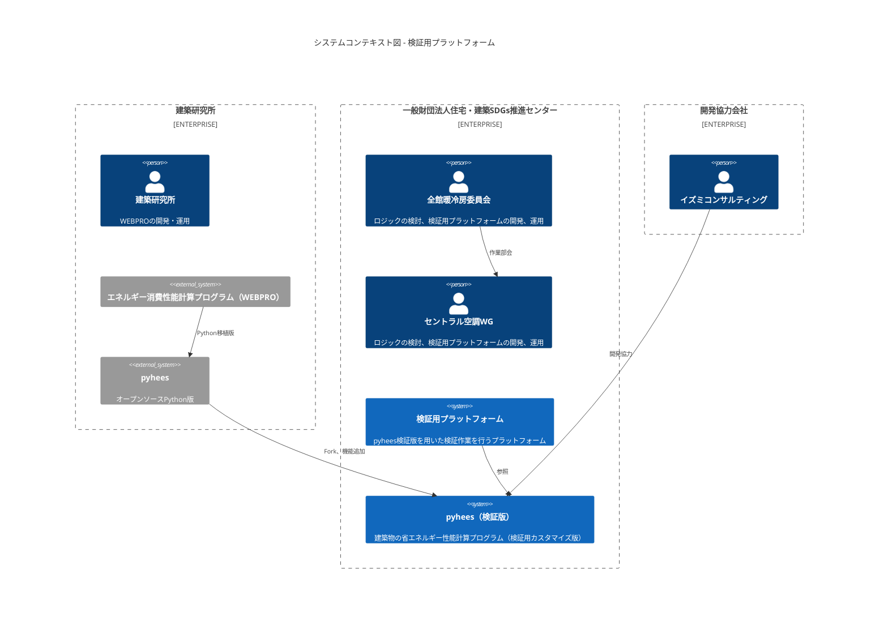

# システム関連図

## 概要
本システムは、建築物の省エネルギー性能を計算・検証するためのプラットフォームです。
建築研究所が提供するオープンソースのpyheesをベースに、IBECsの全館暖冷房委員会が計算ロジックの検証用に開発・運用しています。

## モデル図

```mermaid
C4Context

title システムコンテキスト図 - 検証用プラットフォーム

Enterprise_Boundary(kenken_boundary, "建築研究所") {
    Person(kenken, "建築研究所", "WEBPROの開発・運用")
    System_Ext(webpro, "エネルギー消費性能計算プログラム（WEBPRO）")
    System_Ext(pyhees, "pyhees", "オープンソースPython版")
}
Enterprise_Boundary(ibecs, "一般財団法人住宅・建築SDGs推進センター") {
    Person(zenkan, "全館暖冷房委員会", "ロジックの検討、検証用プラットフォームの開発、運用")
    Person(central_wg, "セントラル空調WG", "ロジックの検討、検証用プラットフォームの開発、運用")
    System(platform, "検証用プラットフォーム", "pyhees検証版を用いた検証作業を行うプラットフォーム")
    System(pyhees_platform, "pyhees（検証版）", "建築物の省エネルギー性能計算プログラム（検証用カスタマイズ版）")
}
Enterprise_Boundary(developers, "開発協力会社") {
    Person(izumi, "イズミコンサルティング")
}

Rel(webpro, pyhees, "Python移植版")
Rel(platform, pyhees_platform, "参照")
Rel(pyhees, pyhees_platform, "Fork、機能追加")
Rel(zenkan, central_wg, "作業部会")
Rel(izumi, pyhees_platform, "開発協力")

UpdateLayoutConfig($c4ShapeInRow="4", $c4BoundaryInRow="4")

```
