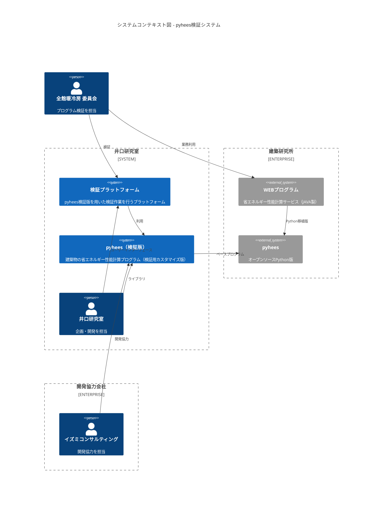

# ステークホルダーマップ

## 概要
本システムは、建築物の省エネルギー性能を計算・検証するためのプラットフォームです。
建築研究所が提供するオープンソースのpyheesをベースに、IBECsの全館暖冷房委員会が検証版として開発・運用しています。

## モデル図

```mermaid
C4Context

title システムコンテキスト図 - pyhees検証システム

Person(zenkan, "全館暖冷房 委員会", "プログラム検証を担当")
System_Boundary(iguchilab, "井口研究室") {
    System(platform, "検証プラットフォーム", "pyhees検証版を用いた検証作業を行うプラットフォーム")
    System(pyheesTest, "pyhees（検証版）", "建築物の省エネルギー性能計算プログラム（検証用カスタマイズ版）")

    Person(iguchi, "井口研究室", "企画・開発を担当")
}
Enterprise_Boundary(base, "建築研究所") {
    System_Ext(webProgram, "WEBプログラム", "省エネルギー性能計算サービス（JAVA製）")
    System_Ext(pyheesBRI, "pyhees", "オープンソースPython版")
}
Enterprise_Boundary(developers, "開発協力会社") {
    Person(izumi, "イズミコンサルティング", "開発協力を担当")
}

Rel(iguchi, platform, "ユーザーインターフェース")
Rel(iguchi, pyheesTest, "ライブラリ")

Rel(izumi, pyheesTest, "開発協力")

Rel(zenkan, platform, "検証")
Rel(zenkan, webProgram, "業務利用")

Rel(platform, pyheesTest, "利用")
Rel(pyheesTest, pyheesBRI, "ベースプログラム")
Rel(webProgram, pyheesBRI, "Python移植版")

UpdateLayoutConfig($c4ShapeInRow="2", $c4BoundaryInRow="2")

```
