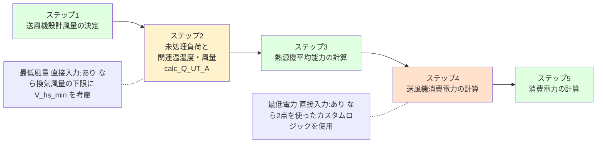
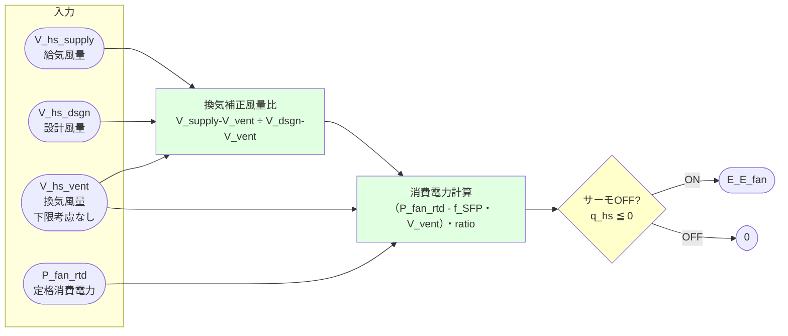
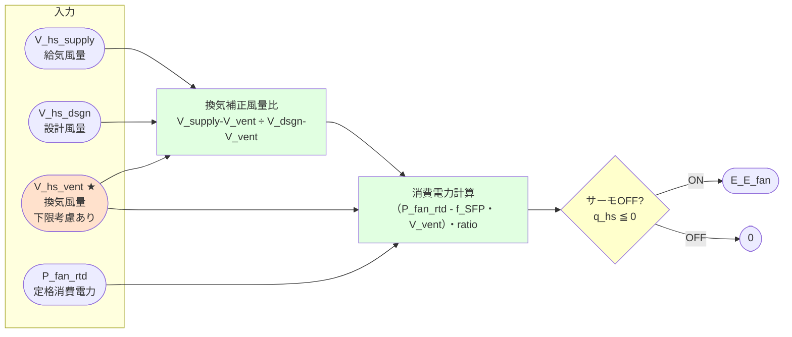
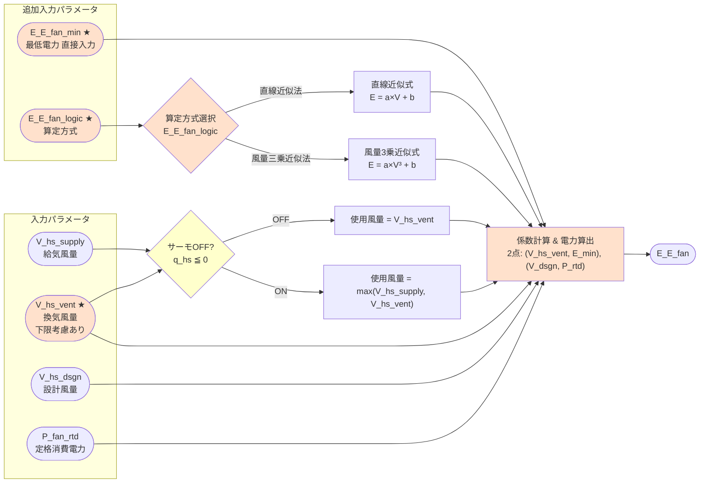

# ユーザーマニュアル 最低風量・最低電力 直接入力

## 目次

- **Part 1: 関連する入力項目**
  - 1.1 入力一覧
  - 1.2 入力の組み合わせ

- **Part 2: 入力によるロジックの変化**
  - 2.1 マクロ視点：計算全体における変更スコープ
  - 2.2 ミクロ視点：ステップ4 の変更前後

---

## Part 1: 関連する入力項目

下記は 暖房・冷房 別に設定されます。

### 1.1 入力一覧

| 入力名 | 入力型 | 入力値 | 内部値 | 規定値 | 変数名 |
|-------|--------|--------|-------|-------|--------|
| ファン消費電力から換気分を引くか | 選択 | 「換気分を引く」 / 「換気分を引かない」 | `1` / `2` | `1` | `subtract_ventilation_power` |
| 最低風量（入力しない or 入力する） | 選択 | 「入力しない」 / 「入力する」 | `1` / `2` | `1` | `input_V_hs_min` |
| 最低風量 [m³/h] | 数値 | 正の実数 [m³/h] | — | — | `V_hs_min` |
| 最低電力（入力しない or 入力する） | 選択 | 「入力しない」 / 「入力する」 | `1` / `2` | `1` | `input_E_E_fan_min` |
| ファン消費電力算定方法 | 選択 | 「直線近似法」 / 「風量三乗近似法」 | `1` / `2` | — | `E_E_fan_logic` |
| 最低電力 [W] | 数値 | 正の実数 [W] | — | — | `E_E_fan_min` |

**ファン消費電力算定方式の種類**

```
【A. 直線近似法】 — 2点間を直線で結ぶ

消費電力 ▲
  P_rtd ●────────────────● 定格点
        │              ／
  E     ●───────────●／
        │          ／
  E_min ●────────● (直接入力)
        │
        └──────────────────────→ 風量
         0    V_min    V_supply    V_dsgn
             最低風量   室内機風量   設計風量

【B. 風量3乗近似法】 — 2点間を3乗曲線で結ぶ

消費電力 ▲
  P_rtd ●────────────────● 定格点
        │                /
  E     ●─────────────●ノ
        │          _ノ
  E_min ●────────● (直接入力)
        |
        └─────────────────────→ 風量
         0    V_min    V_supply    V_dsgn
             最低風量   室内機風量   設計風量
```

### 1.2 入力の組み合わせ

```
「最低風量（入力しない or 入力する）」= 「入力しない」
  ├─ 「ファン消費電力から換気分を引くか」★ 有効
  │   選択肢: 「換気分を引く」 → 内部値: 1
  │   選択肢: 「換気分を引かない」 → 内部値: 2
  └─ 以降の設定は無効、従来式を使用

「最低風量（入力しない or 入力する）」= 「入力する」
  ├─ 「ファン消費電力から換気分を引くか」★ 無視される（使用されない）
  ├─ 「最低風量 [m³/h]」[必須] ← 入力値を直接使用
  └─ 「最低電力（入力しない or 入力する）」
       「最低電力（入力しない or 入力する）」= 「入力しない」
       └─ 最低風量のみ反映、消費電力は従来式

       「最低電力（入力しない or 入力する）」= 「入力する」
       ├─ 「最低電力 [W]」[必須] ← 入力値を直接使用
       └─ 「ファン消費電力算定方法」[必須]
            選択肢: 「直線近似法」 → 内部値: 1
            選択肢: 「風量三乗近似法」 → 内部値: 2
```

---

## Part 2: 入力によるロジックの変化

### 2.1 マクロ視点: 計算全体における変更スコープ

共通のフローである [計算フロー タイプ1・2](計算フロー_タイプ1・2.md) の各ステップにおける影響範囲を示します。

**凡例：**

| 色 | 意味 |
|---|------|
| 🟩 | 変更なし（従来ロジックのまま） |
| 🟨 | 間接的に影響あり |
| 🟧 | 直接的に影響あり（本機能のメイン変更箇所） |



| ステップ | 変更条件 | 影響 | 内容 |
|---------|---------|------|------|
| ステップ 1 | — | なし | 設計風量 V_hs_dsgn は変わらない |
| ステップ 2 | 最低風量 直接入力:あり | **あり** | 各区画の全般換気量を V_hs_min の比率で再配分 |
| ステップ 3 | — | なし | 熱源機能力の計算は変わらない |
| ステップ 4 | 最低電力 直接入力:あり | **あり** | V_hs_vent の下限適用・消費電力算定式の切替 |
| ステップ 5 | — | なし | 圧縮機電力の計算は変わらない |

---

### 2.2 ミクロ視点: ステップ4 の変更前後

#### 2.2.1 Before（従来式）— 下限考慮なし



---

#### 2.2.2 After: 最低風量 直接入力: あり & 最低電力 直接入力: なし

**最低風量のみ指定。計算ロジックは Before と同じだが、V_hs_vent が Step 2 で既に上書き済み。**

> **注意**: V_hs_vent の修正は Step 2 (calc_Q_UT_A) で実施済み（max(V_hs_min, Σ V_vent_g_i) または V_hs_min）



---

#### 2.2.3 After: 最低風量 直接入力: あり & 最低電力 直接入力: あり

**最低風量 + 最低電力を指定。カスタム消費電力式を使用。従来式とは異なり、サーモOFF時も電力を計算する（0にならない）。**

> **注意**: V_hs_vent の修正は Step 2 (calc_Q_UT_A) で実施済み（max(V_hs_min, Σ V_vent_g_i) または V_hs_min）



---

## 更新履歴

- 2026-03-12: 初版作成
