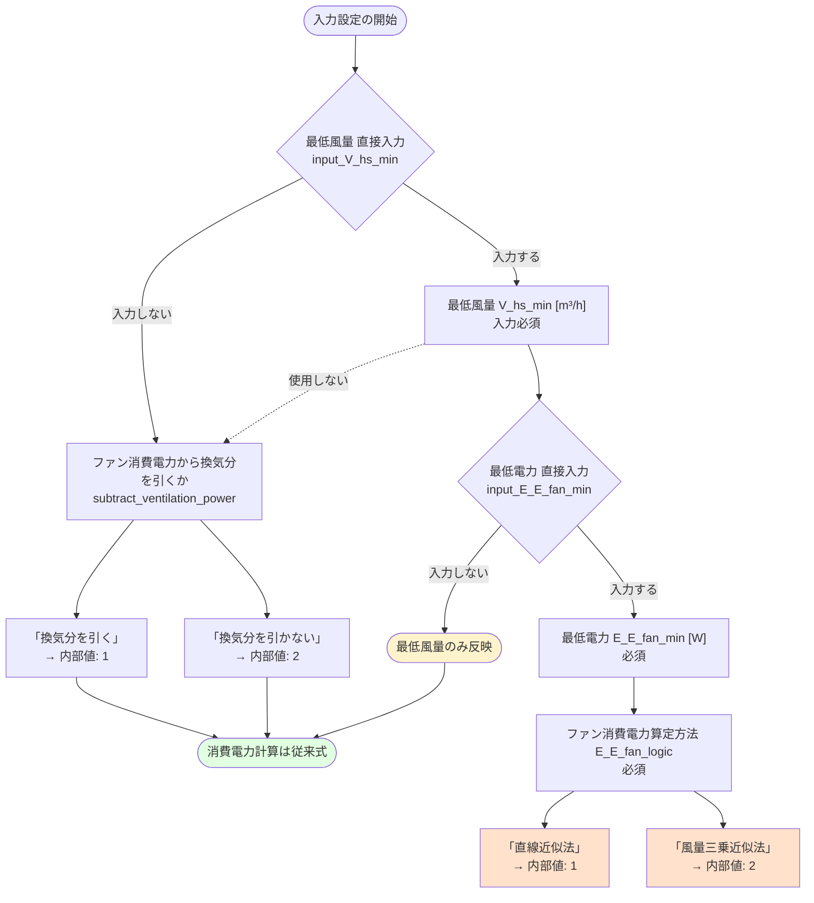
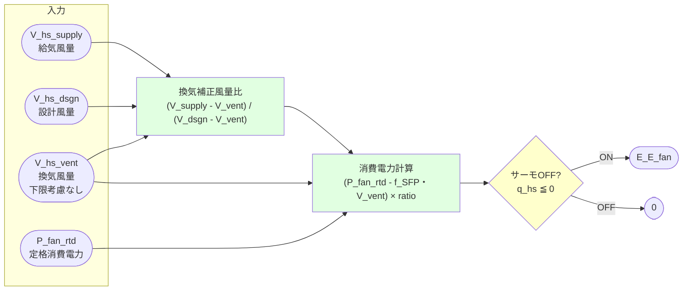
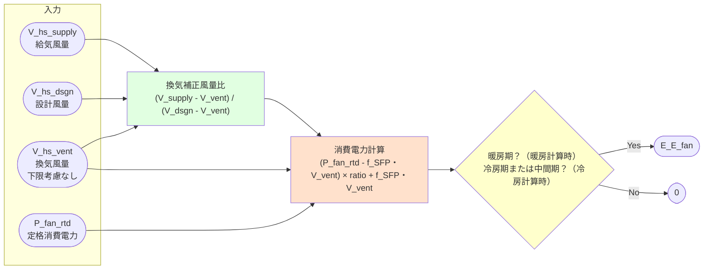
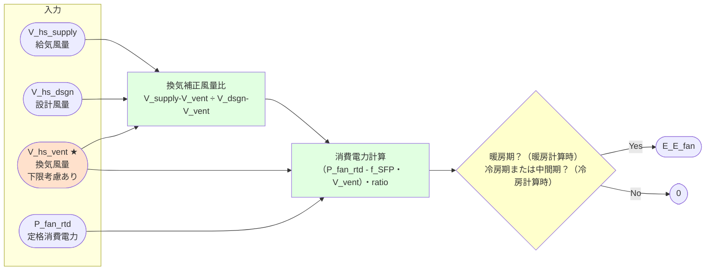
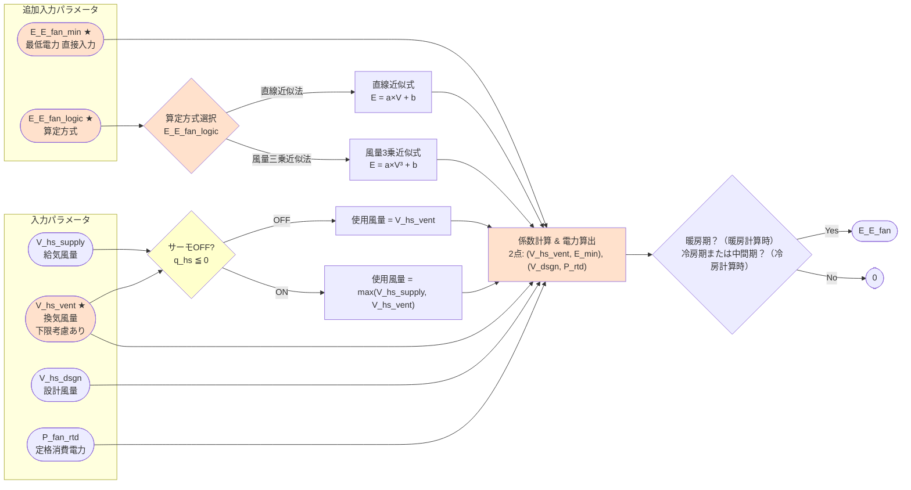

# ユーザーマニュアル 最低風量・最低電力 直接入力

## 目次

- **Part 1: 関連する入力項目**
  - 1.1 入力一覧
  - 1.2 入力の組み合わせ

- **Part 2: 入力によるロジックの変化**
  - 2.1 マクロ視点：計算全体における変更スコープ
  - 2.2 ミクロ視点：ステップ2 の変更前後
  - 2.3 ミクロ視点：ステップ4 の変更前後
    - 2.3.1 Before（従来式）— 換気分を引く（既定値） & 最低風量なし
    - 2.3.2 After: 換気分を引かない & 最低風量なし
    - 2.3.3 After: 最低風量あり & 最低電力なし
    - 2.3.4 After: 最低風量あり & 最低電力あり

---

## Part 1: 関連する入力項目

下記は 暖房・冷房 別に設定されます。

### 1.1 入力一覧

| 入力名 | 入力型 | 入力値 | 内部値 | 既定値 | 変数名 |
|-------|--------|--------|-------|-------|--------|
| ファン消費電力から換気分を引くか | 選択 | 「換気分を引く」 / 「換気分を引かない」 | `1` / `2` | `1` | `subtract_ventilation_power` |
| 最低風量（入力しない or 入力する） | 選択 | 「入力しない」 / 「入力する」 | `1` / `2` | `1` | `input_V_hs_min` |
| 最低風量 [m³/h] | 数値 | 正の実数 [m³/h] | — | — | `V_hs_min` |
| 最低電力（入力しない or 入力する） | 選択 | 「入力しない」 / 「入力する」 | `1` / `2` | `1` | `input_E_E_fan_min` |
| ファン消費電力算定方法 | 選択 | 「直線近似法」 / 「風量三乗近似法」 | `1` / `2` | — | `E_E_fan_logic` |
| 最低電力 [W] | 数値 | 正の実数 [W] | — | — | `E_E_fan_min` |

**ファン消費電力算定方式の種類**

| 点 | 風量 x | 消費電力 y（直線近似法） | 消費電力 y（風量3乗近似法） |
|----|--------|--------------------------|-------------------------------|
| 最低点（直接入力） | `V_hs_min` | `E_E_fan_min` | `E_E_fan_min` |
| 算定点 | `V_hs_supply` | `E = a · V + b` | `E = a · V³ + b` |
| 定格点 | `V_hs_dsgn` | `P_fan_rtd` | `P_fan_rtd` |

### 1.2 入力の組み合わせ

---

## Part 2: 入力によるロジックの変化

### 2.1 マクロ視点: 計算全体における変更スコープ

共通のフローである [計算フロー タイプ1・2](計算フロー_タイプ1・2.md) の各ステップにおける影響範囲を示します。

**凡例：**

| 色 | 意味 |
|---|------|
| 🟩 | 変更なし（従来ロジックのまま） |
| 🟨 | 間接的に影響あり |
| 🟧 | 直接的に影響あり（本機能のメイン変更箇所） |

| ステップ | 変更条件 | 影響 | 内容 |
|---------|---------|------|------|
| ステップ 1 | — | なし | 設計風量 V_hs_dsgn は変わらない |
| ステップ 2 | 最低風量 直接入力:あり | **あり** | 各区画の全般換気量を合計が V_hs_min になるように決定 |
| ステップ 3 | — | なし | 熱源機能力の計算は変わらない |
| ステップ 4 | 最低電力 直接入力:あり | **あり** | V_hs_vent の下限適用・消費電力算定式の切替 |
| ステップ 5 | — | なし | 圧縮機電力の計算は変わらない |

---

### 2.2 ミクロ視点: ステップ2 の変更前後

ステップ2 (`calc_Q_UT_A`) では、各区画の換気風量 `V_vent_g_i` を集計して `V_hs_vent` を決定する。
最低風量 直接入力:あり の場合、 `V_vent_g_i` の合計が `V_hs_min` がとなるように `V_vent_g_i` が決定する。

#### 2.2.1 Before（従来式）

---

#### 2.2.2 After: 最低風量 直接入力: あり

> V_hs_vent はこの値のまま ステップ4 へ渡される（ステップ4 では下限の再適用は行わない）。

---

### 2.3 ミクロ視点: ステップ4 の変更前後

#### 2.3.1 Before（従来式）— 換気分を引く（既定値）・下限考慮なし

---

#### 2.3.2 After: 換気分を引かない & 最低風量なし

**最低風量・最低電力の直接入力なしで、「換気分を引かない」を選択した場合。**

従来式(2.3.1)との違い:
- 換気分のファン消費電力 $$P_{fan,vent} = f_{SFP} \times V_{hs,vent}$$ を差し引かず、消費電力に含める
- サーモOFF（$$q_{hs} \ge 0$$）でも電力を 0 にせず、**暖冷房期間中は常にファン消費電力を計上**する
  - 暖房: 暖房期間のみ計上
  - 冷房: 冷房期間 + 中間期に計上

> **ポイント**: 従来式では `P_fan_rtd` から換気分 `f_SFP・V_vent` を差し引いた上で風量比を掛けていたが、「換気分を引かない」ではその差し引いた分をそのまま加算して戻す。結果として、ファンの全消費電力（空調分 + 換気分）が暖冷房設備の消費電力として計上される。

---

#### 2.3.3 After: 最低風量 直接入力: あり & 最低電力 直接入力: なし

**最低風量のみ指定。計算ロジックは Before と同じだが、V_hs_vent が Step 2 で既に上書き済み。従来式とは異なり、サーモOFF時も電力を計算する（0にならない）。**

> **注意**: V_hs_vent の修正は Step 2 (calc_Q_UT_A) で実施済み（max(V_hs_min, Σ V_vent_g_i) または V_hs_min）

---

#### 2.3.4 After: 最低風量 直接入力: あり & 最低電力 直接入力: あり

**最低風量 + 最低電力を指定。カスタム消費電力式を使用。従来式とは異なり、サーモOFF時も電力を計算する（0にならない）。**

> **注意**: V_hs_vent の修正は Step 2 (calc_Q_UT_A) で実施済み（max(V_hs_min, Σ V_vent_g_i) または V_hs_min）

---

## 更新履歴

- 2026-03-12: 初版作成
- 2026-03-16: 間違いを修正
  2026-03-17: 換気分を引かない場合について追記
