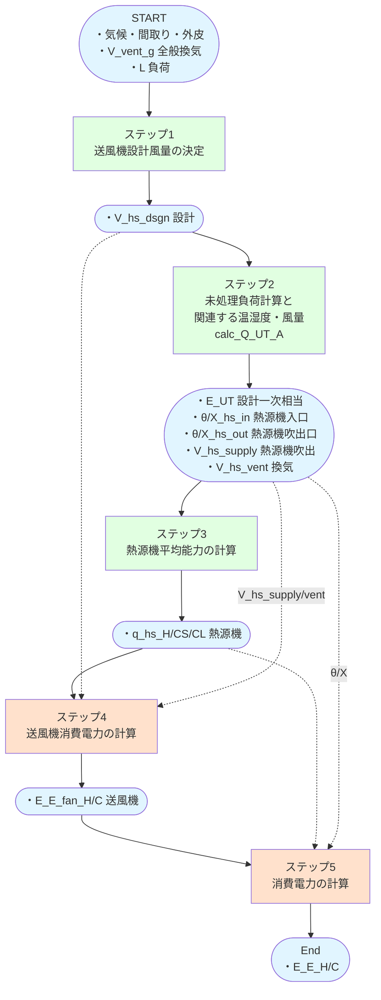
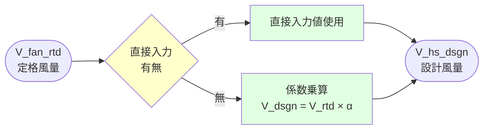
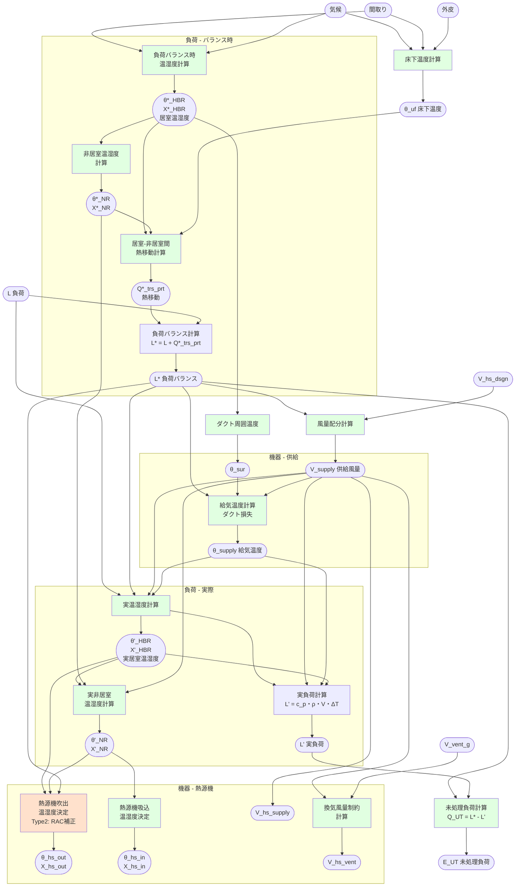
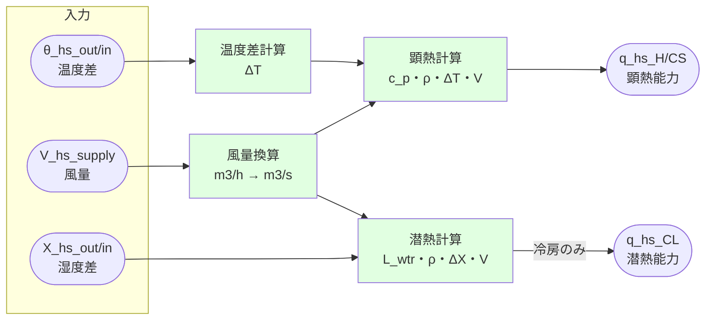
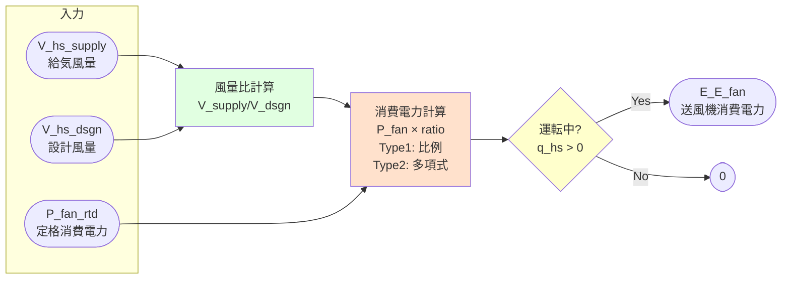
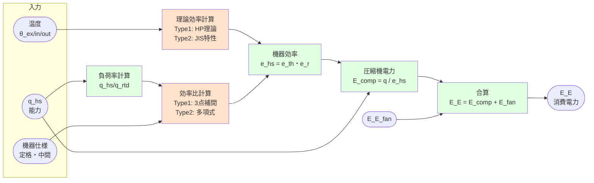

# 計算フロー タイプ1・2

## 本ドキュメントの目的

従来の全館空調の計算方法であるタイプ1（ダクト式セントラル空調機）と、
消費電力の計算をルームエアコンに置き換えたタイプ2（現行省エネ法ルームエアコンモデル）の計算フローを示します。

### 図の凡例

各ダイアグラムにおける色の意味:

| 色     | 意味             | 説明                           |
| ------ | ---------------- | ------------------------------ |
| 🟢 緑 | 共通処理         | タイプ 1・2 で同じロジック       |
| 🟠 橙 | **タイプ別処理** | **タイプ 1・2 で異なるロジック** |
| 🟡 黄 | 分岐判定         | 条件分岐                       |
| 🔵 青 | 入出力データ     | 入力値・出力結果               |

## 全体図

### 主要変数

| 変数名 | 単位 | 説明 | 次元 |
|--------|------|------|------|
| `L_{H/C}_d_t` | MJ/h | 暖房・冷房負荷 | 8760時間 |
| `V_vent_g_d_t` | m³/h | 全般換気風量 | 8760時間 |
| `V_hs_dsgn_{H/C}` | m³/h | 送風機設計風量 | スカラー |
| `E_UT_d_t` | MJ/h | 未処理負荷（一次エネ換算済） | 8760時間 |
| `Theta_hs_out_d_t` | ℃ | 吹出温度 | 8760時間 |
| `Theta_hs_in_d_t` | ℃ | 吸込温度 | 8760時間 |
| `Theta_ex_d_t` | ℃ | 外気温度 | 8760時間 |
| `X_hs_out_d_t` | kg/kg(DA) | 吹出絶対湿度 | 8760時間 |
| `X_hs_in_d_t` | kg/kg(DA) | 吸込絶対湿度 | 8760時間 |
| `V_hs_supply_d_t` | m³/h | 給気風量合計 | 8760時間 |
| `V_hs_vent_d_t` | m³/h | 換気風量 | 8760時間 |
| `q_hs_{H/CS/CL}_d_t` | W | 熱源機平均能力（暖房H/冷房CS・CL） | 8760時間 |
| `E_E_fan_d_t` | kWh/h | 送風機消費電力 | 8760時間 |
| `E_E_{H/C}_d_t` | kWh/h | 消費電力 | 8760時間 |

---

## ステップ1: 送風機設計風量の決定

### 概要

このステップでは、暖房・冷房の送風機設計風量を決定します。

- 直接入力値の使用
- 入力仕様からの計算

**タイプ 1・2 による違い:**
計算ロジック自体は共通。パラメータのみ異なる(RAC専用の定格風量)

### 計算フロー概要

### 主要変数

**インプット:**

| 変数名 | 単位 | 説明 | 次元 |
|--------|------|------|------|
| `V_fan_rtd_{H/C}` | m³/h | 定格風量（入力仕様） | スカラー |
| `V_hs_dsgn_{H/C}` | m³/h | 設計風量（直接入力時） | スカラー |

**アウトプット:**

| 変数名 | 単位 | 説明 | 次元 |
|--------|------|------|------|
| `V_hs_dsgn_{H/C}` | m³/h | 送風機設計風量 | スカラー |

---

## ステップ2: 未処理負荷と関連する風量・温湿度の計算

### 概要

消費電力計算のメインとなるこのステップでは、主要な関数 `calc_Q_UT_A()` を呼び出します。

- 初期化・気象データ読込
- 床下温度
- 各区画の設定温度・湿度
- 各区画の供給風量
- 給気温度・湿度
- 吹出温度・湿度
- 吸込温度・湿度
- 未処理負荷

**タイプ 1・2 による違い:**
両タイプともに同じ計算フロー (`calc_Q_UT_A`) を使用しますが、Type 2ではRAC特有の補正係数（C_af、デフロスト補正等）が適用され、容量可変型コンプレッサー対応時は異なる特性曲線を使用します。

**共通の計算フロー:**
1. 気候・外皮・間取りから床下温度と基準温湿度を計算
2. 負荷バランス時の温湿度を求める（負荷ゼロでの熱平衡状態）
3. 実際の温湿度を室内設定と負荷から逆算
4. 未処理負荷を計算（実負荷 - 処理可能負荷）
5. 設計風量から各区画への供給風量を配分
6. 供給温湿度・吹出温湿度・吸込温湿度を算出（ダクト損失考慮）
7. 換気風量を分離して出力

### 計算フロー概要

> **ℹ️ 注意:** オレンジ色のボックスはType 2でRAC特有の補正係数が適用される処理を示します。

### 主要変数

**インプット:**

| 変数名 | 単位 | 説明 | 次元 |
|--------|------|------|------|
| `L_{H/C}_d_t` | MJ/h | 暖房・冷房負荷 | 8760時間 |
| `V_vent_g_d_t` | m³/h | 全般換気風量 | 8760時間 |
| `V_hs_dsgn_{H/C}` | m³/h | 送風機設計風量 | スカラー |

**中間変数:**

| 変数名 | 単位 | 説明 | 次元 |
|--------|------|------|------|
| `Theta_ex_d_t` | ℃ | 外気温度 | 8760時間 |
| `X_ex_d_t` | kg/kg(DA) | 外気絶対湿度 | 8760時間 |
| `Theta_uf_d_t` | ℃ | 床下温度 | 8760時間 |
| `Theta_req_d_t_i` | ℃ | 要求室温 | 5区画×8760時間 |
| `X_req_d_t_i` | kg/kg(DA) | 要求絶対湿度（冷房のみ） | 5区画×8760時間 |
| `V_supply_d_t_i` | m³/h | 各区画への供給風量 | 5区画×8760時間 |
| `Theta_supply_d_t_i` | ℃ | 給気温度 | 5区画×8760時間 |
| `X_supply_d_t_i` | kg/kg(DA) | 給気絶対湿度（冷房のみ） | 5区画×8760時間 |

**アウトプット:**

| 変数名 | 単位 | 説明 | 次元 |
|--------|------|------|------|
| `E_UT_d_t` | MJ/h | 未処理負荷（一次エネ換算済） | 8760時間 |
| `Theta_hs_out_d_t` | ℃ | 吹出温度 | 8760時間 |
| `Theta_hs_in_d_t` | ℃ | 吸込温度 | 8760時間 |
| `X_hs_out_d_t` | kg/kg(DA) | 吹出絶対湿度（冷房のみ） | 8760時間 |
| `X_hs_in_d_t` | kg/kg(DA) | 吸込絶対湿度（冷房のみ） | 8760時間 |
| `V_hs_supply_d_t` | m³/h | 給気風量合計 | 8760時間 |
| `V_hs_vent_d_t` | m³/h | 換気風量 | 8760時間 |

---

## ステップ3: 熱源機平均能力の計算

### 概要

このステップでは、吹出温湿度・吸込温湿度・風量から熱源機の平均能力を計算します。

- 暖房: 全熱能力
- 冷房: 顕熱能力・潜熱能力を分離

**タイプ 1・2 による違い:**
計算ロジック自体は共通。パラメータのみ異なる(RAC特有の風量制御特性を反映)

### 計算フロー概要

### 主要変数

**インプット:**

| 変数名 | 単位 | 説明 | 次元 |
|--------|------|------|------|
| `Theta_hs_out_d_t` | ℃ | 吹出温度 | 8760時間 |
| `Theta_hs_in_d_t` | ℃ | 吸込温度 | 8760時間 |
| `V_hs_supply_d_t` | m³/h | 給気風量合計 | 8760時間 |
| `X_hs_out_d_t` | kg/kg(DA) | 吹出絶対湿度（冷房のみ） | 8760時間 |
| `X_hs_in_d_t` | kg/kg(DA) | 吸込絶対湿度（冷房のみ） | 8760時間 |

**アウトプット:**

| 変数名 | 単位 | 説明 | 次元 |
|--------|------|------|------|
| `q_hs_H_d_t` | W | 熱源機平均能力（暖房） | 8760時間 |
| `q_hs_CS_d_t` | W | 熱源機平均能力（冷房顕熱） | 8760時間 |
| `q_hs_CL_d_t` | W | 熱源機平均能力（冷房潜熱） | 8760時間 |

---

## ステップ4: 送風機消費電力の計算

### 概要

このステップでは、送風機の消費電力を計算します。

**タイプ別の計算方法:**

| 項目 | タイプ 1 (ダクト式) | タイプ 2 (ルームエアコン) |
|------|-------------------|------------------------|
| 基本方式 | 定格消費電力と風量比による計算 | RAC内蔵ファンの消費電力特性曲線を使用 |
| 計算式 | `E_fan = P_fan_rtd・(V_supply / V_dsgn)` | `P_fan = a4・V⁴ + a3・V³ + a2・V² + a1・V + a0` |
| パラメータ | ・風量比 (V_supply / V_dsgn) ・定格消費電力 P_fan_rtd ・比静圧 f_SFP (換気風量考慮) | ・風量 V ・4次多項式係数 a0～a4 ・係数は機器仕様（定格冷房能力等）から決定 |
| 適用条件 | 運転時のみ計上 (q_hs > 0) | 運転時のみ計上 (q_hs > 0) |

### 計算フロー概要

> **ℹ️ 注意:** オレンジ色のボックスは Type 1/2 で計算ロジックが異なる処理を示します。

### 主要変数

**インプット:**

| 変数名 | 単位 | 説明 | 次元 |
|--------|------|------|------|
| `V_hs_supply_d_t` | m³/h | 給気風量合計 | 8760時間 |
| `V_hs_vent_d_t` | m³/h | 換気風量 | 8760時間 |
| `V_hs_dsgn` | m³/h | 送風機設計風量 | スカラー |
| `P_fan_rtd` | W | 定格消費電力 | スカラー |
| `f_SFP` | W/(m³/h) | 比静圧 | スカラー |

**アウトプット:**

| 変数名 | 単位 | 説明 | 次元 |
|--------|------|------|------|
| `E_E_fan_d_t` | kWh/h | 送風機消費電力 | 8760時間 |

---

## ステップ5: 消費電力の計算

### 概要

このステップでは、熱源機の消費電力を計算します。

**タイプ別の計算方法:**

| 項目 | タイプ 1 (ダクト式) | タイプ 2 (ルームエアコン) |
|------|-------------------|------------------------|
| 理論効率算出 | ヒートポンプサイクル理論効率 温度条件から算出 | JIS試験データベース 外気温度と負荷率から基準入出力関数で計算 |
| 効率比算出 | 3点補間（定格・中間・最小） 負荷率から特性曲線で算出 | 4次多項式: `f(x) = a4・x⁴ + a3・x³ + a2・x² + a1・x + a0` 係数a0～a4は外気温度と定格冷房能力から算出 |
| 実効効率 | `e_hs = e_th・e_r` | 同左 |
| 圧縮機電力 | `E_comp = q_hs / e_hs` | 同左 |
| 総消費電力 | `E_E = E_comp + E_fan` | 同左 |
| 特性曲線 | ヒートポンプサイクル理論 | 容量可変型: 表4、非可変型: 表3 |
| 補正 | - | 最大能力制約、デフロスト補正を適用 |

### 計算フロー概要

> **ℹ️ 注意:** オレンジ色のボックスは Type 1/2 で計算ロジックが異なる処理を示します。

### 主要変数

**インプット:**

| 変数名 | 単位 | 説明 | 次元 |
|--------|------|------|------|
| `q_hs_H_d_t` | W | 熱源機平均能力（暖房） | 8760時間 |
| `q_hs_CS_d_t` | W | 熱源機平均能力（冷房顕熱） | 8760時間 |
| `q_hs_CL_d_t` | W | 熱源機平均能力（冷房潜熱） | 8760時間 |
| `Theta_ex_d_t` | ℃ | 外気温度 | 8760時間 |
| `機器仕様` | - | 定格能力、定格COP、性能曲線係数等 | - |

**アウトプット:**

| 変数名 | 単位 | 説明 | 次元 |
|--------|------|------|------|
| `E_E_d_t` | kWh/h | 消費電力 | 8760時間 |

---

## タイプ 1・2 の主要な違いまとめ

> **💡 ヒント:** 上記ダイアグラムで🟠オレンジ色で示された処理は、以下の表で具体的な違いを確認できます。

| 項目 | Type 1 (ダクト式) | Type 2 (ルームエアコン) |
|------|-------------------|------------------------|
| 機器タイプ | ダクト式セントラル空調機 | ルームエアコンディショナー |
| 設計風量決定 | V_fan_rtd × 係数 | 同左 |
| 熱源機能力計算 | 共通式 | 共通式 |
| **送風機電力計算** | **風量比例** | **4次多項式補間** ⭐ |
| **圧縮機電力計算** | **理論効率 × 効率比** ⭐ | **基準入出力関数（表ベース）** ⭐ |
| 容量制御 | 定格・中間・最小の3点 | 連続可変（dualcompressor時） |
| デフロスト補正 | C_df = 0.77 (固定) | C_df = 0.77 (固定) |
| 風量補正 | C_af (専用室・風向固定) | C_af (専用室・風向固定) |
| 特性曲線 | ヒートポンプサイクル理論 | JIS試験データベース |

⭐ = ダイアグラムで🟠オレンジ色で示された主要な違い

<!-- TODO: 未確認
| 主要参照規格 | 付録A, B | 第三節、表3, 表4 |
-->

---

## 更新履歴

- 2026-01-30: 初版作成（暖房・冷房統合版）
- 2026-02-07: Type 2 (ルームエアコン) の処理フローを追加
- 2026-03-02: ドキュメントの説明文を修正
