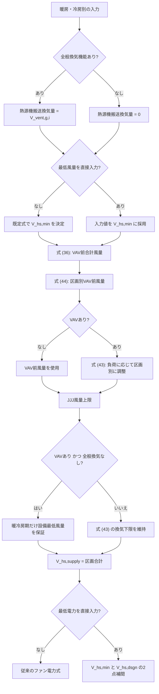

# 風量設定・VAV・全般換気の計算ルート

## 1. この文書の目的

ダクト式セントラル空調の風量計算では、住宅の全般換気量、熱源機の設備最低風量、
設計風量、VAV、風量上限、新床下空調が同じ計算系列へ入る。名称が似ていても
意味は異なるため、本書では「どの設定が、どの計算ルートと出力に影響するか」を
表とフローで示す。

本書の対象は `jjjexperiment` の拡張計算である。建研由来の式番号を追跡できるよう、
式 (36)、式 (43)、式 (44) などの番号は維持する。

## 2. まず区別する3つの風量

| 記号・変数 | 意味 | 全般換気なしの場合 |
| --- | --- | --- |
| $V_{\mathrm{vent},g,i}$ | 住宅の区画別全般換気量 | 住宅側の換気負荷計算には使う |
| $V_{\mathrm{hs,vent},i}$ | 熱源機が実際に搬送する区画別全般換気量 | 0 m³/h |
| $V_{\mathrm{hs,min}}$ | 熱源機・送風機の設備最低風量 | 暖冷房期は有効。中間期の運転命令ではない |

重要なのは、次の2つを同一視しないことである。

$$
V_{\mathrm{hs,vent}} \neq V_{\mathrm{hs,min}}
$$

全般換気なしなら $V_{\mathrm{hs,vent}}=0$ である。一方、暖房期・冷房期に熱源機が
運転対象なら、サーモOFFまたは小負荷でも $V_{\mathrm{hs,min}}$ を下回らない。

## 3. 計算で使う主な風量

| 段階 | 変数 | 内容 |
| --- | --- | --- |
| 入力・既定値 | `V_hs_min` | 設備最低風量。直接入力時は入力値、未入力時は既定式 |
| 入力・能力から決定 | `V_hs_dsgn` | 暖房・冷房別の設計風量 |
| 式 (36) | `V_dash_hs_supply_d_t` | 熱源機のVAV前合計風量 |
| 式 (44) | `V_dash_supply_d_t_i` | 各区画のVAV前風量・区画別上限 |
| 式 (43) | `V_supply_d_t_i_before` | 負荷・要求温度から求めた区画別給気風量 |
| JJJ上限処理後 | `V_supply_d_t_i` | 風量上限と設備最低風量を反映した実区画風量 |
| 集計 | `V_hs_supply_d_t` | 熱源機の実合計風量 $=\sum_i V_{\mathrm{supply},i}$ |

入力値は次を満たす必要がある。

$$
0 < V_{\mathrm{hs,min}} \le V_{\mathrm{hs,dsgn}}
$$

最低電力を直接入力する場合は2点補間を行うため、分母を0にしないよう厳密に
$V_{\mathrm{hs,min}} < V_{\mathrm{hs,dsgn}}$ とする。

## 4. 全体フロー

## 5. `VAV` と `general_ventilation` の組合せ

| VAV | 全般換気 | 暖冷房期の区画風量 | サーモOFF・小負荷 | 中間期 |
| --- | --- | --- | --- | --- |
| なし | あり | VAV前風量 | 換気量以上 | 換気量を搬送 |
| あり | あり | 式 (43) で負荷配分 | 区画換気量以上 | 換気量を搬送 |
| なし | なし | VAV前風量 | 設備最低風量 | 0 m³/h |
| あり | なし | 式 (43) 後に設備下限を保証 | 設備最低風量 | 0 m³/h |

「全般換気なし」は熱源機で換気空気を搬送しないという意味であり、暖冷房期の
設備最低風量を無効にする意味ではない。また `V_hs_min` は中間期に熱源機を
換気設備として運転する指令ではない。

## 6. 最低風量・最低電力の設定ルート

| 最低風量直接入力 | 最低電力直接入力 | 風量 | ファン電力 |
| --- | --- | --- | --- |
| なし | なし | 既定最低風量 | 従来式 |
| あり | なし | 入力 `V_hs_min` | 従来式。ただし換気分を二重控除しない |
| あり | あり | 入力 `V_hs_min` | 最低点と定格点の2点補間 |
| なし | あり | 入力不整合 | 最低電力入力は採用しない |

直線近似は次式である。

$$
P_{\mathrm{fan}}(V)=aV+b
$$

$$
a=\frac{P_{\mathrm{fan,rtd}}-E_{\mathrm{fan,min}}}
{V_{\mathrm{hs,dsgn}}-V_{\mathrm{hs,min}}},\qquad
b=E_{\mathrm{fan,min}}-aV_{\mathrm{hs,min}}
$$

三乗近似は次式である。

$$
P_{\mathrm{fan}}(V)=aV^3+b
$$

どちらも次の2点を必ず通る。

$$
P_{\mathrm{fan}}(V_{\mathrm{hs,min}})=E_{\mathrm{fan,min}}
$$

$$
P_{\mathrm{fan}}(V_{\mathrm{hs,dsgn}})=P_{\mathrm{fan,rtd}}
$$

実合計風量が0 m³/hの時刻は、冷房計算が中間期電力を担当する構造であっても
ファン電力を0とする。

## 7. 計算モデル別の注意

| 計算モデル | 最低風量直接入力 | 最低電力直接入力 | 備考 |
| --- | --- | --- | --- |
| ダクト式セントラル空調機 | 有効 | 有効 | 本書の主対象 |
| RAC活用型・現行省エネ法RACモデル | 有効 | 有効 | 定格ファン電力の取得元が異なる |
| 電中研モデル | 有効 | 有効 | 定格ファン電力の取得元が異なる |
| RAC活用型・潜熱評価モデル | 従来どおり影響なし | 専用経路 | 汎用最低風量経路へ強制的に入れない |

## 8. 風量上限とVAV

風量上限は式 (43) の後に適用する。その後、`VAVあり × 全般換気なし` の
暖冷房期に限り、設備最低風量へ不足する分を区画別の残余風量へ比例配分する。

時刻 $t$ の不足量は次である。

$$
\Delta V_t=\max\left(
V_{\mathrm{hs,min}}-\sum_iV_{\mathrm{supply},i,t},0
\right)
$$

区画上限までの余地を
$H_{i,t}=\max(V'_{\mathrm{supply},i,t}-V_{\mathrm{supply},i,t},0)$
とすると、補正は次の形で配分する。

$$
V^{\mathrm{corrected}}_{\mathrm{supply},i,t}
=V_{\mathrm{supply},i,t}
+\Delta V_t\frac{H_{i,t}}{\sum_jH_{j,t}}
$$

入力が正しければ、設備最低風量と設計風量の両方を満たす。最低風量が設計風量を
超える矛盾した入力は、上限を破って計算を続けず入力エラーとする。

## 9. 新床下空調との関係

新床下空調の逐次計算では、Excel床下14との数値契約に従い、区画別のVAV前配分を
固定面積比で求める。通常経路の負荷依存配分
`change_supply_volume_before_vav_adjust` をそのまま渡すと、床下14 Goldenの年間値が
大きく変わることを確認している。

したがって、床下経路へ負荷依存配分を適用する変更は今回の不具合修正に含めない。
採用する場合はExcel側の配分規則、8760時間系列、年間値を独立してレビューし、
床下14 Goldenを合意のうえで更新する必要がある。

## 10. 運用時の確認表

| 確認項目 | 正常条件 |
| --- | --- |
| 最低風量 | 正の有限値 |
| 設計風量 | 正の有限値、かつ最低風量以上 |
| 最低電力を使う場合の風量 | 最低風量が設計風量未満 |
| 最低電力 | 0以上、定格ファン電力以下 |
| 全般換気なし・暖冷房期 | 合計風量が設備最低風量以上 |
| 全般換気なし・中間期 | 合計風量・ファン電力とも0 |
| 全般換気あり・中間期 | 熱源機が換気量を搬送 |
| 新床下空調 | Excel床下14に合わせ、固定面積比の配分を使用 |

関連資料は [最低風量・最低電力 直接入力](最低風量_最低電力_直接入力.md) と
[風量設定・VAVの不具合修正メモ](風量設定_VAV_不具合修正メモ.md) を参照する。
