# プロセスモデル：消費電力計算（標準）

## 概要

本ドキュメントでは、暖房・冷房消費電力の標準計算プロセスを詳細に記載します。

暖房と冷房は同じプロセスで処理されるため、統合して記述します。

**記法:** 
- `{H|C}` : 暖房はH、冷房はC
- `{温度|温度・湿度}` : 暖房は温度のみ、冷房は温度・湿度の両方

**注意:** 負荷計算（calc_heating_load/calc_cooling_load）は`pyhees`既存ライブラリをそのまま使用しています。

**各モデルの特徴:**

| type | 名称 | 特徴 |
|------|------|------|
| type1 | ダクト式セントラル | 機器仕様による性能曲線 |
| type2 | RAC現行省エネ法 | JIS C 9612基準のCOP |
| type3 | RAC潜熱評価 | 潜熱負荷を詳細評価 |
| type4 | 電中研モデル | R係数による特性曲線 |

---

## 消費電力計算の全体フロー

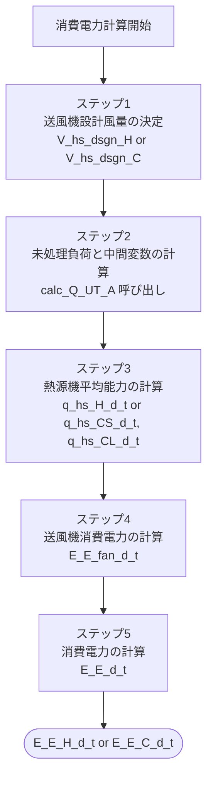

### 消費電力計算の主要変数

| 変数名 | 単位 | 説明 | 次元 |
|--------|------|------|------|
| `V_hs_dsgn_{H\|C}` | m³/h | 送風機設計風量 | スカラー |
| `Q_UT_H_d_t_i` | MJ/h | 未処理暖房負荷 | 5区画×8760時間 |
| `E_C_UT_d_t` | MJ/h | 未処理冷房負荷（一次エネ換算済） | 8760時間 |
| `q_hs_H_d_t` | W | 熱源機平均暖房能力 | 8760時間 |
| `q_hs_CS_d_t` | W | 熱源機平均冷房顕熱能力 | 8760時間 |
| `q_hs_CL_d_t` | W | 熱源機平均冷房潜熱能力 | 8760時間 |
| `E_E_fan_{H\|C}_d_t` | kWh/h | 送風機消費電力 | 8760時間 |
| `E_E_{H\|C}_d_t` | kWh/h | 消費電力 | 8760時間 |

---

## ステップ1: 送風機設計風量の決定

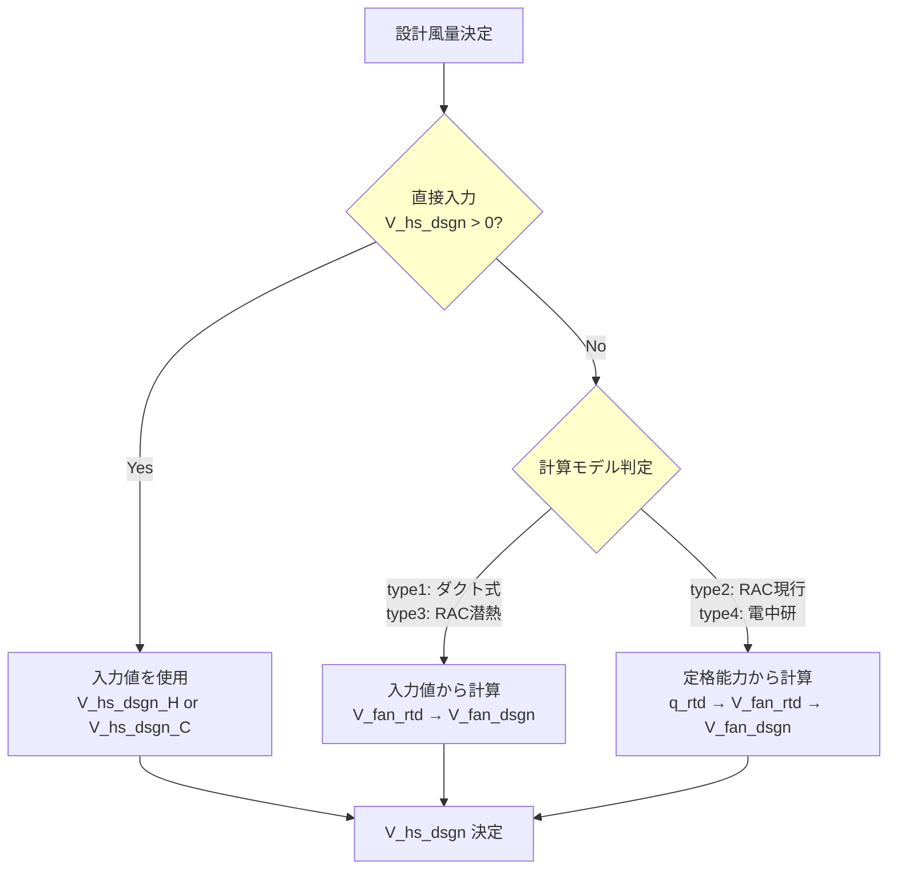

**計算式:**
- `V_fan_dsgn = V_fan_rtd × 係数`（詳細は仕様書参照）

---

## ステップ2: 未処理負荷と中間変数の計算（calc_Q_UT_A 呼び出し）

このステップでは `calc_Q_UT_A()` を呼び出します。

**取得する変数:**

| 変数名 | 暖房時 | 冷房時 | 説明 |
|--------|--------|--------|------|
| 未処理負荷 | `Q_UT_H_d_t_i` | `E_C_UT_d_t` | 機器で処理できない負荷 |
| 吹出温度 | `Theta_hs_out_d_t` | `Theta_hs_out_d_t` | 熱源機からの吹出温度 |
| 吸込温度 | `Theta_hs_in_d_t` | `Theta_hs_in_d_t` | 熱源機への吸込温度 |
| 吹出湿度 | - | `X_hs_out_d_t` | 熱源機からの吹出絶対湿度 |
| 吸込湿度 | - | `X_hs_in_d_t` | 熱源機への吸込絶対湿度 |
| 給気風量 | `V_hs_supply_d_t` | `V_hs_supply_d_t` | 各区画への給気風量合計 |
| 換気風量 | `V_hs_vent_d_t` | `V_hs_vent_d_t` | 換気のための風量 |
| その他 | `Theta_ex_d_t`, `C_df_H_d_t` | `Theta_ex_d_t` | 外気温度、デフロスト補正係数（暖房のみ） |

### calc_Q_UT_A の全体フロー

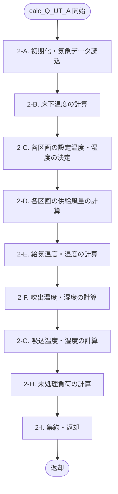

### calc_Q_UT_A の主要変数

| 変数名 | 単位 | 説明 | 次元 |
|--------|------|------|------|
| `Theta_ex_d_t` | ℃ | 外気温度 | 8760時間 |
| `X_ex_d_t` | kg/kg(DA) | 外気絶対湿度 | 8760時間 |
| `Theta_uf_d_t` | ℃ | 床下温度 | 8760時間 |
| `Theta_req_d_t_i` | ℃ | 要求室温 | 5区画×8760時間 |
| `X_req_d_t_i` | kg/kg(DA) | 要求絶対湿度（冷房のみ） | 5区画×8760時間 |
| `V_supply_d_t_i` | m³/h | 各区画への供給風量 | 5区画×8760時間 |
| `Theta_supply_d_t_i` | ℃ | 給気温度 | 5区画×8760時間 |
| `X_supply_d_t_i` | kg/kg(DA) | 給気絶対湿度（冷房のみ） | 5区画×8760時間 |
| `Theta_hs_out_d_t` | ℃ | 吹出温度 | 8760時間 |
| `Theta_hs_in_d_t` | ℃ | 吸込温度 | 8760時間 |
| `X_hs_out_d_t` | kg/kg(DA) | 吹出絶対湿度（冷房のみ） | 8760時間 |
| `X_hs_in_d_t` | kg/kg(DA) | 吸込絶対湿度（冷房のみ） | 8760時間 |
| `V_hs_supply_d_t` | m³/h | 給気風量合計 | 8760時間 |
| `V_hs_vent_d_t` | m³/h | 換気風量 | 8760時間 |


### 2-A. 初期化・気象データ読込

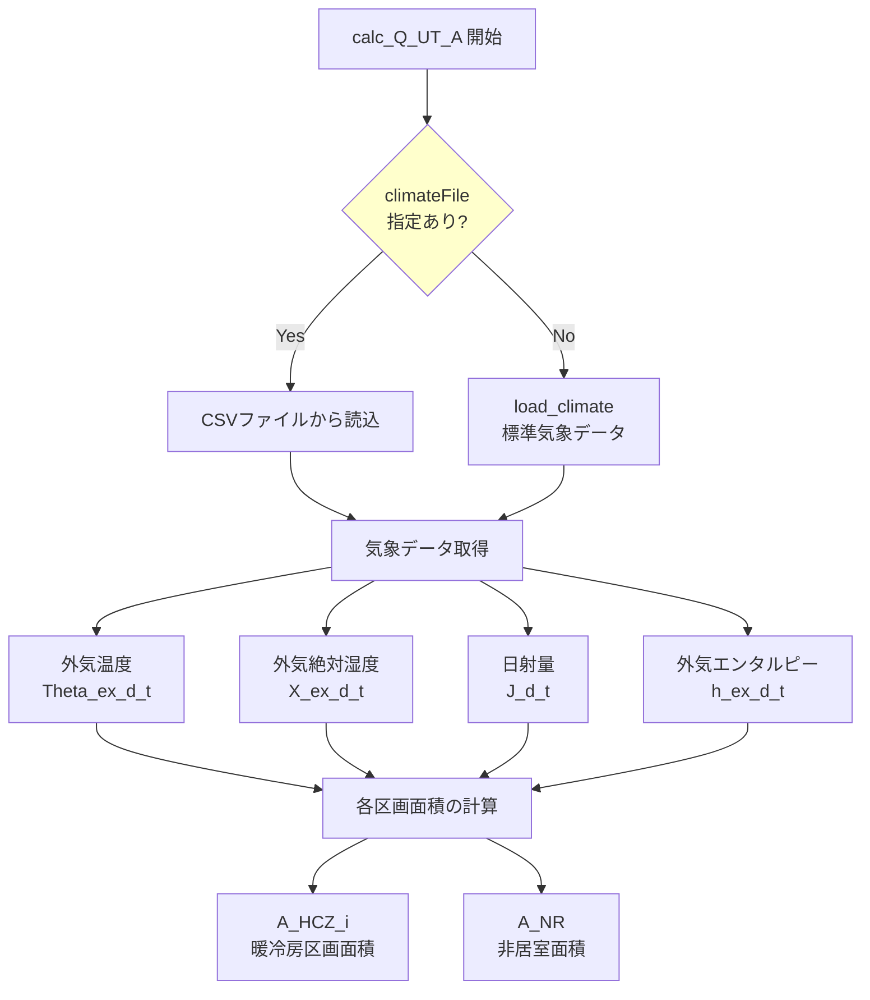

### 2-B. 床下温度の計算

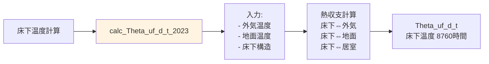

### 2-C. 各区画の設定温度・湿度の決定

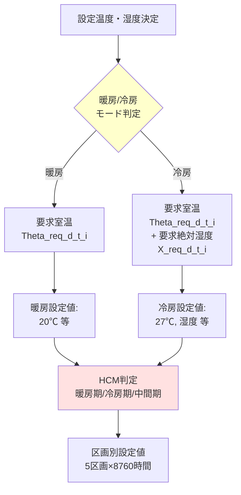

### 2-D. 各区画の供給風量の計算

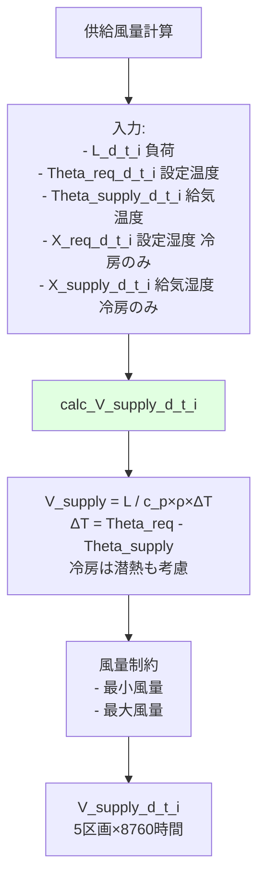

### 2-E. 給気温度・湿度の計算

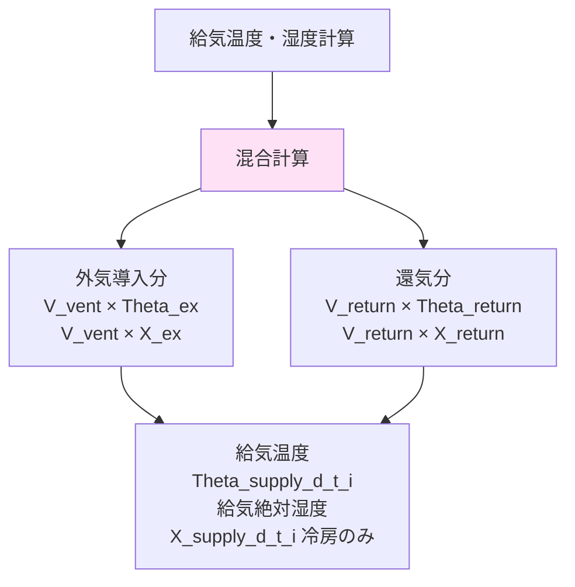

### 2-F. 吹出温度・湿度の計算

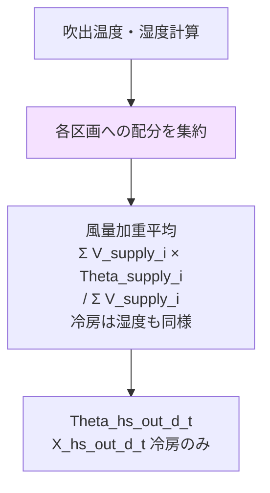

### 2-G. 吸込温度・湿度の計算

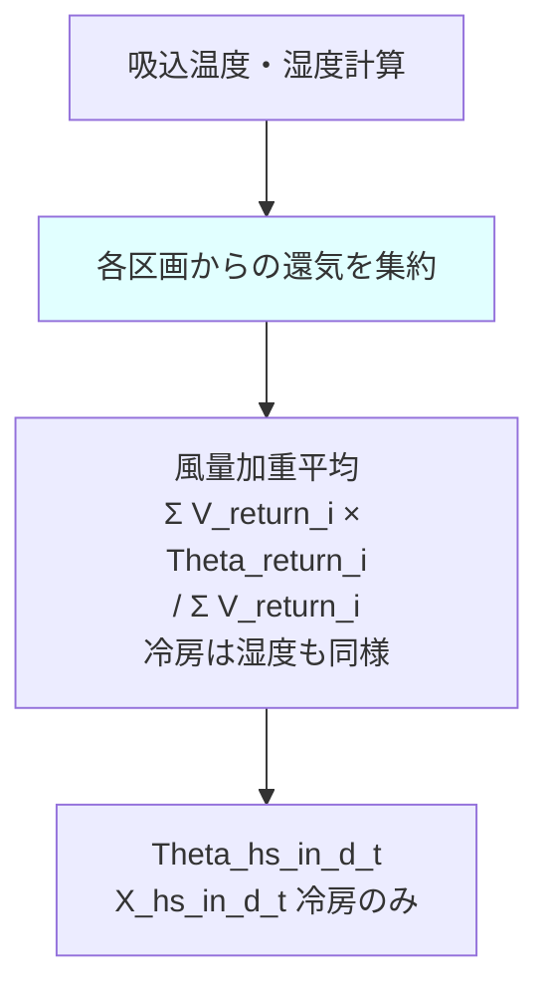

### 2-H. 未処理負荷の計算

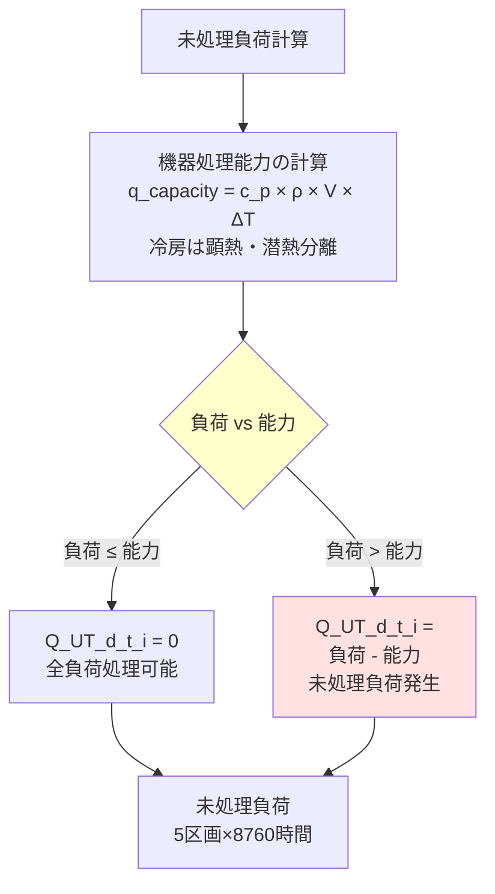

### 2-I. 集約・返却

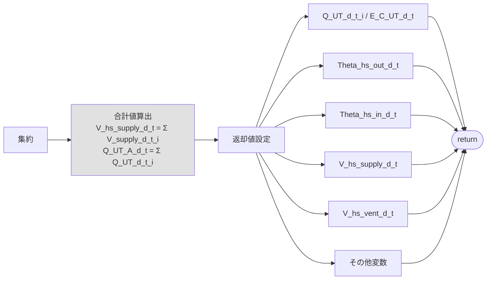

---

## ステップ3: 熱源機平均能力の計算

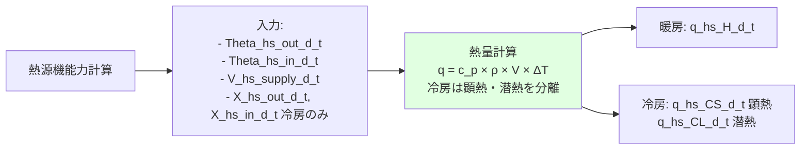

**計算式:**
- 暖房: `q_hs_H_d_t = get_q_hs_H_d_t(...)`
- 冷房: `q_hs_CS_d_t, q_hs_CL_d_t = get_q_hs_C_d_t_2(...)`

---

## ステップ4: 送風機消費電力の計算

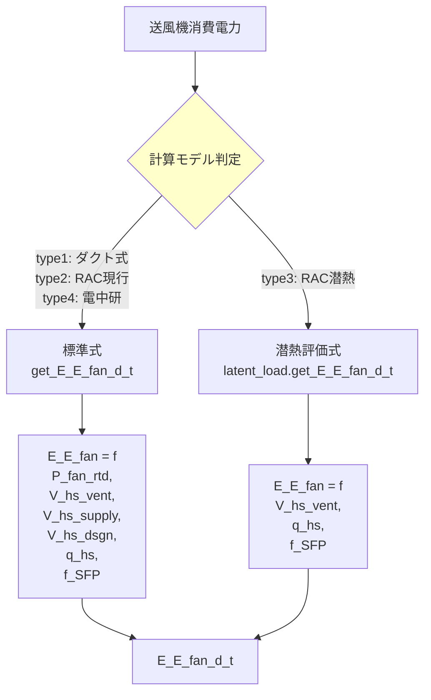

**標準式の概要:**
```
E_E_fan_d_t = (V_hs_supply_d_t / V_hs_dsgn)^3 × P_fan_rtd / 1000
            または
              V_hs_vent_d_t × f_SFP / 1000
```
（詳細は条件分岐あり）

---

## ステップ5: 消費電力の計算

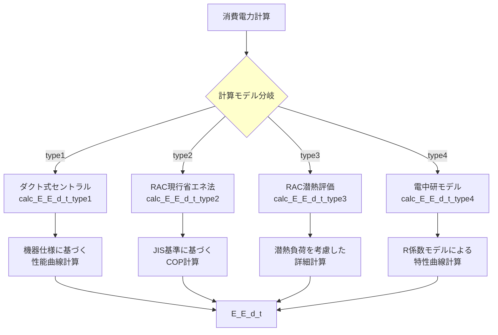

---

## 更新履歴

- 2026-01-30: 初版作成（暖房・冷房統合版）
