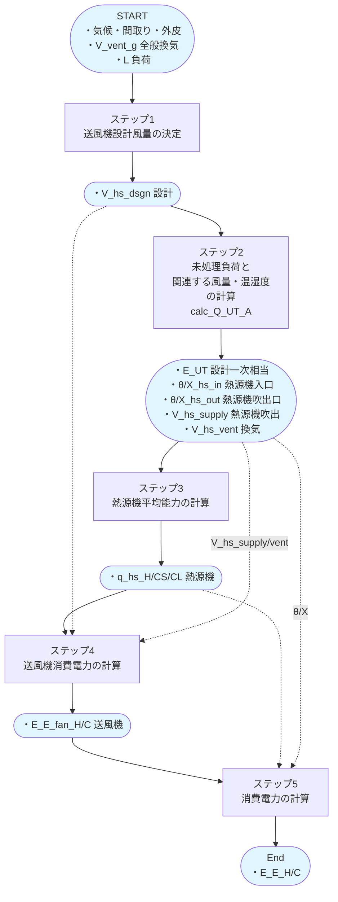
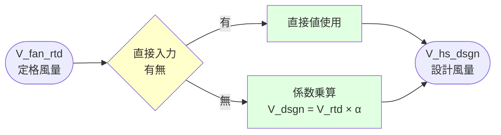
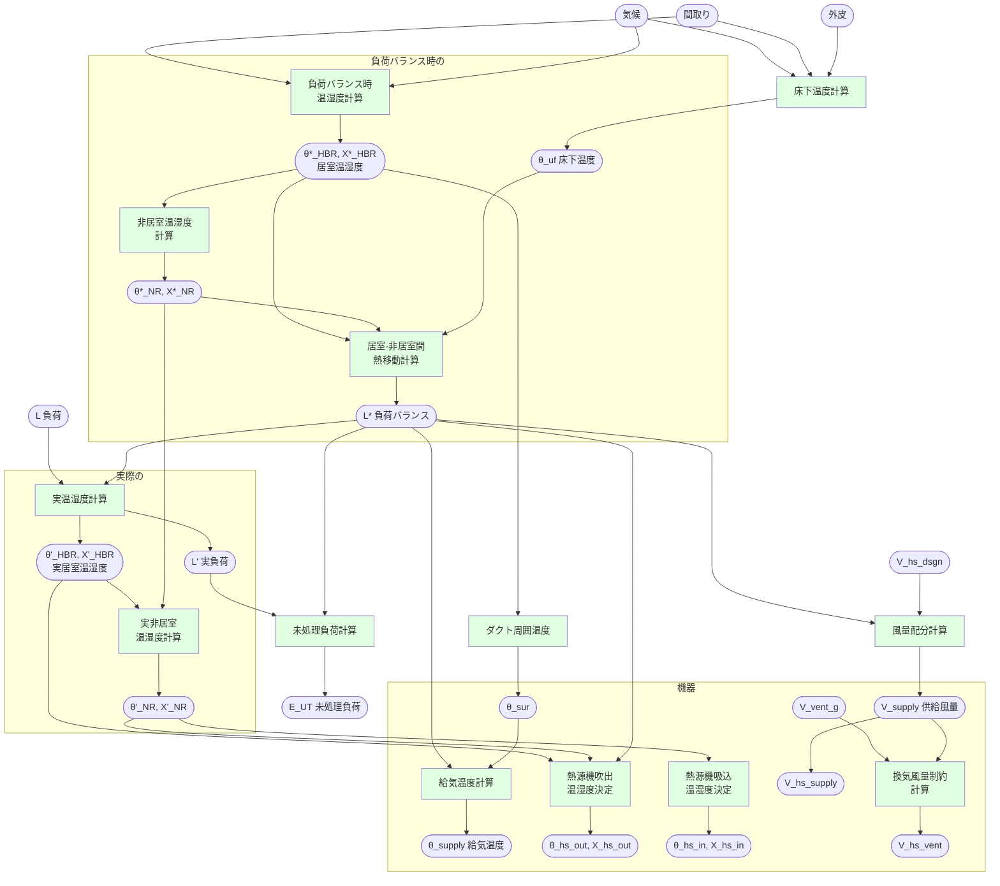
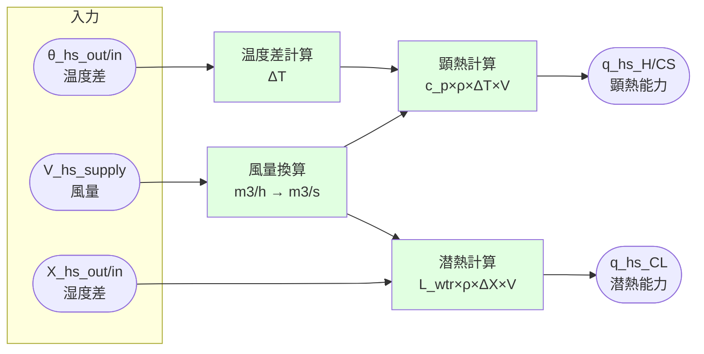
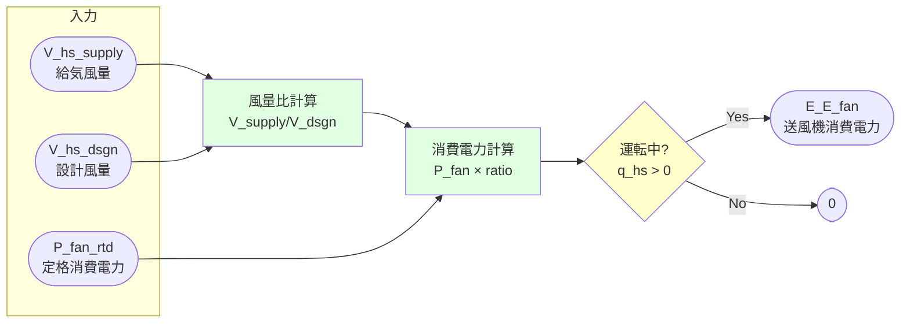
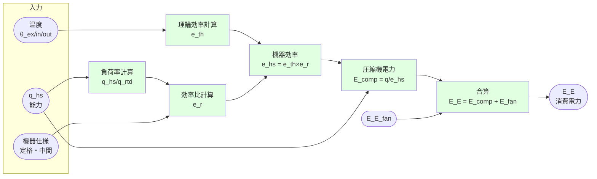

# プロセスモデル:消費電力計算(標準)

## 本ドキュメントの目的

本ドキュメントは **type1(ダクト式)をデフォルトサンプルケース** として、
pyhees 既存ライブラリベースの標準的な消費電力計算フローを示すものです。
本プロジェクトで追加しているカスタム計算タイプや追加オプションは含まれません。

各カスタム計算タイプや追加オプション利用による変更は、本モデルをベースとして表現されます。
**計算プロセス自体の変更にフォーカスするため、暖冷房による違いを統一した表現を採用しています。**

## 全体図

### 主要変数

| 変数名 | 単位 | 説明 | 次元 |
|--------|------|------|------|
| `L_{H/C}_d_t` | MJ/h | 暖房・冷房負荷 | 8760時間 |
| `V_vent_g_d_t` | m³/h | 全般換気風量 | 8760時間 |
| `V_hs_dsgn_{H/C}` | m³/h | 送風機設計風量 | スカラー |
| `E_UT_d_t` | MJ/h | 未処理負荷（一次エネ換算済） | 8760時間 |
| `Theta_hs_out_d_t` | ℃ | 吹出温度 | 8760時間 |
| `Theta_hs_in_d_t` | ℃ | 吸込温度 | 8760時間 |
| `Theta_ex_d_t` | ℃ | 外気温度 | 8760時間 |
| `X_hs_out_d_t` | kg/kg(DA) | 吹出絶対湿度 | 8760時間 |
| `X_hs_in_d_t` | kg/kg(DA) | 吸込絶対湿度 | 8760時間 |
| `V_hs_supply_d_t` | m³/h | 給気風量合計 | 8760時間 |
| `V_hs_vent_d_t` | m³/h | 換気風量 | 8760時間 |
| `q_hs_{H/CS/CL}_d_t` | W | 熱源機平均能力（暖房H/冷房CS・CL） | 8760時間 |
| `E_E_fan_d_t` | kWh/h | 送風機消費電力 | 8760時間 |
| `E_E_{H/C}_d_t` | kWh/h | 消費電力 | 8760時間 |

---

## ステップ1: 送風機設計風量の決定

### 概要

このステップでは、暖房・冷房の送風機設計風量を決定します。

- 直接入力値の使用
- 入力仕様からの計算

### 計算フロー概要

**type1基本パターン:**
- 直接入力がある場合: その値を使用
- それ以外: `V_hs_dsgn = V_fan_rtd × 係数`

### 主要変数

**インプット:**

| 変数名 | 単位 | 説明 | 次元 |
|--------|------|------|------|
| `V_fan_rtd_{H/C}` | m³/h | 定格風量（入力仕様） | スカラー |
| `V_hs_dsgn_{H/C}` | m³/h | 設計風量（直接入力時） | スカラー |

**アウトプット:**

| 変数名 | 単位 | 説明 | 次元 |
|--------|------|------|------|
| `V_hs_dsgn_{H/C}` | m³/h | 送風機設計風量 | スカラー |

---

## ステップ2: 未処理負荷と関連する風量・温湿度の計算

### 概要

このステップでは主要な関数 `calc_Q_UT_A()` を呼び出します。

- 初期化・気象データ読込
- 床下温度
- 各区画の設定温度・湿度
- 各区画の供給風量
- 給気温度・湿度
- 吹出温度・湿度
- 吸込温度・湿度
- 未処理負荷

### 計算フロー概要

**type1基本パターン:**
- 気候・外皮・間取りから床下温度と基準温湿度を計算
- 負荷バランス時の温湿度を求める（負荷ゼロでの熱平衡状態）
- 実際の温湿度を室内設定と負荷から逆算
- 未処理負荷を計算（実負荷 - 処理可能負荷）
- 設計風量から各区画への供給風量を配分
- 供給温湿度・吹出温湿度・吸込温湿度を算出（ダクト損失考慮）
- 換気風量を分離して出力

### 主要変数

**インプット:**

| 変数名 | 単位 | 説明 | 次元 |
|--------|------|------|------|
| `L_{H/C}_d_t` | MJ/h | 暖房・冷房負荷 | 8760時間 |
| `V_vent_g_d_t` | m³/h | 全般換気風量 | 8760時間 |
| `V_hs_dsgn_{H/C}` | m³/h | 送風機設計風量 | スカラー |

**中間変数:**

| 変数名 | 単位 | 説明 | 次元 |
|--------|------|------|------|
| `Theta_ex_d_t` | ℃ | 外気温度 | 8760時間 |
| `X_ex_d_t` | kg/kg(DA) | 外気絶対湿度 | 8760時間 |
| `Theta_uf_d_t` | ℃ | 床下温度 | 8760時間 |
| `Theta_req_d_t_i` | ℃ | 要求室温 | 5区画×8760時間 |
| `X_req_d_t_i` | kg/kg(DA) | 要求絶対湿度（冷房のみ） | 5区画×8760時間 |
| `V_supply_d_t_i` | m³/h | 各区画への供給風量 | 5区画×8760時間 |
| `Theta_supply_d_t_i` | ℃ | 給気温度 | 5区画×8760時間 |
| `X_supply_d_t_i` | kg/kg(DA) | 給気絶対湿度（冷房のみ） | 5区画×8760時間 |

**アウトプット:**

| 変数名 | 単位 | 説明 | 次元 |
|--------|------|------|------|
| `E_UT_d_t` | MJ/h | 未処理負荷（一次エネ換算済） | 8760時間 |
| `Theta_hs_out_d_t` | ℃ | 吹出温度 | 8760時間 |
| `Theta_hs_in_d_t` | ℃ | 吸込温度 | 8760時間 |
| `X_hs_out_d_t` | kg/kg(DA) | 吹出絶対湿度（冷房のみ） | 8760時間 |
| `X_hs_in_d_t` | kg/kg(DA) | 吸込絶対湿度（冷房のみ） | 8760時間 |
| `V_hs_supply_d_t` | m³/h | 給気風量合計 | 8760時間 |
| `V_hs_vent_d_t` | m³/h | 換気風量 | 8760時間 |

---

## ステップ3: 熱源機平均能力の計算

### 概要

このステップでは、吹出温湿度・吸込温湿度・風量から熱源機の平均能力を計算します。

- 暖房: 全熱能力
- 冷房: 顕熱能力・潜熱能力を分離

### 計算フロー概要

**type1基本パターン:**
- 温度差から顕熱能力を計算
- 湿度差から潜熱能力を計算（冷房のみ）
- 風量を時間単位に換算して乗算

### 主要変数

**インプット:**

| 変数名 | 単位 | 説明 | 次元 |
|--------|------|------|------|
| `Theta_hs_out_d_t` | ℃ | 吹出温度 | 8760時間 |
| `Theta_hs_in_d_t` | ℃ | 吸込温度 | 8760時間 |
| `V_hs_supply_d_t` | m³/h | 給気風量合計 | 8760時間 |
| `X_hs_out_d_t` | kg/kg(DA) | 吹出絶対湿度（冷房のみ） | 8760時間 |
| `X_hs_in_d_t` | kg/kg(DA) | 吸込絶対湿度（冷房のみ） | 8760時間 |

**アウトプット:**

| 変数名 | 単位 | 説明 | 次元 |
|--------|------|------|------|
| `q_hs_H_d_t` | W | 熱源機平均能力（暖房） | 8760時間 |
| `q_hs_CS_d_t` | W | 熱源機平均能力（冷房顕熱） | 8760時間 |
| `q_hs_CL_d_t` | W | 熱源機平均能力（冷房潜熱） | 8760時間 |

---

## ステップ4: 送風機消費電力の計算

### 概要

このステップでは、送風機の消費電力を計算します。

- 定格消費電力と風量比による計算
- 換気風量と比静圧による計算

### 計算フロー概要

**type1基本パターン:**
- 実風量と設計風量の比率を計算
- 定格消費電力にその比率を乗算
- 運転時のみ計上（q_hs > 0）

### 主要変数

**インプット:**

| 変数名 | 単位 | 説明 | 次元 |
|--------|------|------|------|
| `V_hs_supply_d_t` | m³/h | 給気風量合計 | 8760時間 |
| `V_hs_vent_d_t` | m³/h | 換気風量 | 8760時間 |
| `V_hs_dsgn` | m³/h | 送風機設計風量 | スカラー |
| `P_fan_rtd` | W | 定格消費電力 | スカラー |
| `f_SFP` | W/(m³/h) | 比静圧 | スカラー |

**アウトプット:**

| 変数名 | 単位 | 説明 | 次元 |
|--------|------|------|------|
| `E_E_fan_d_t` | kWh/h | 送風機消費電力 | 8760時間 |

---

## ステップ5: 消費電力の計算

### 概要

このステップでは、熱源機の消費電力を計算します。

- 機器仕様に基づく性能曲線
- 外気温度・熱源機能力による補正

### 計算フロー概要

**type1基本パターン:**
- 温度条件から理論効率を算出
- 負荷率から効率比を特性曲線で算出
- 両者を掛けて実効効率を取得
- 能力を効率で割って圧縮機電力を計算
- 送風機電力を加算

### 主要変数

**インプット:**

| 変数名 | 単位 | 説明 | 次元 |
|--------|------|------|------|
| `q_hs_H_d_t` | W | 熱源機平均能力（暖房） | 8760時間 |
| `q_hs_CS_d_t` | W | 熱源機平均能力（冷房顕熱） | 8760時間 |
| `q_hs_CL_d_t` | W | 熱源機平均能力（冷房潜熱） | 8760時間 |
| `Theta_ex_d_t` | ℃ | 外気温度 | 8760時間 |
| `機器仕様` | - | 定格能力、定格COP、性能曲線係数等 | - |

**アウトプット:**

| 変数名 | 単位 | 説明 | 次元 |
|--------|------|------|------|
| `E_E_d_t` | kWh/h | 消費電力 | 8760時間 |

---

## 更新履歴

- 2026-01-30: 初版作成（暖房・冷房統合版）
